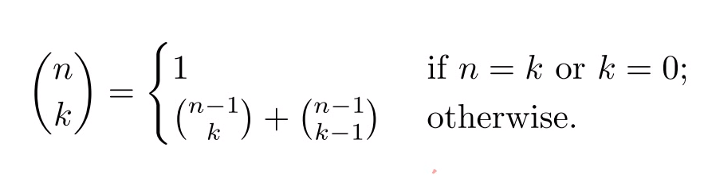

# Dynamic Programming

- Richard Bellman이 제시한 방법론
- 재귀 함수의 비효율성을 개선할 수 있다.
- 기본적으로 for문의 형태로 이루어져 있다.

## Fibonacci

### memorization

- 피보나치의 계산값을 배열 안에 넣어 값을 기억하도록 함으로써 중복 계산을 방지하는 방법.
- 이 배열을 cache라고 부르고, 저장하는 과정을 caching이라고 한다.
- 일반적으로 재귀적 형식을 띄고 있다.
- top-down 방식이며, n이 늘어날수록 처리 속도가 급격하게 느려진다.

### bottom-up

- for문(반복문)을 사용하는 방법.
- f(1)부터 위로 차례대로 올라오면서 계산하기 때문에 이미 계산된 값을 사용할 수 있다.

## binomial coefficient

- 이항 계수 ... nCk => n개 중 k 개를 선택하는 경우의 수
- nCk = n! / (n-k)! * k!
- 그런데 이 수식을 곧이 곧대로 사용하면 값이 커질 경우에 오버플로우가 발생할 수 있다.
- 위 수식은 다음과 같이 변환이 가능하다

>

- 그런데 이 역시 매 회차당 두 번의 연산이 계속해서 이루어지면서 중복되는 비효율이 발생한다.

### memorization

- n과 k라는 두 개의 변수를 받기 때문에 이중 배열 int[n+1] [k+1]을 생성하고, 이 값을 -1로 초기화한다.
- n==k인 경우와 k==0인 경우에는 1을 return한다.
- 이미 배열 값이 있는 경우는 배열 값을 return한다.
- 만약 배열 값이 없다면 [n] [k]에 [n-1] [k] + [n-1] [k-1] 값을 부여한다.

### bottom-up

- 마찬가지로 이중 배열을 생성한다.
- 이때 값을 초기화하지 않고, 중첩 for문을 이용하여 위의 초기화 과정과 유사하게 배열의 원소 값을 할당한다.
- i는 0부터 n까지, j는 0부터 i 또는 k까지 증가한다.
- i==j인 경우와 j==0인 경우에는 1을 부여한다.
- [i] [j] 에 마찬가지로 [i-1] [j] + [i-1] [j-1]을 부여한다.
- for문이 끝나면 [n] [k] 값을 반환한다.

## 참조

<https://www.youtube.com/watch?v=K15qLnKKrow>