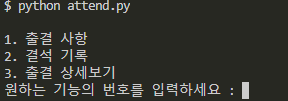
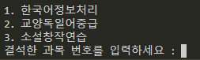
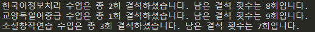
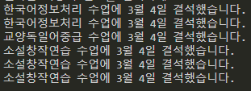

[TOC]

# 결석 기록 프로그램 만들기


## 초기 계획

- 챗봇에 출결 키워드로 기능을 추가한다.
- '결석 수업명' 키워드를 입력할 경우 '수업명=[]' 리스트에 인수를 하나씩 추가한다.
- '출결 수업명' 키워드를 입력할 경우 해당 수업 리스트의 길이[len(수업명)]을 return한다.


## 문제점

```python
#attend.py
A=[]

....
```

- 다음과 같이 코드를 작성할 경우 아무리 많이 출석기록을 한다고 해도 매번 프로그램이 실행될 때마다 리스트가 초기화되어버리기 때문에 무의미하다.
- 게다가 변수 선언을 사용하지 않으면 리스트 길이 자체를 return할 수 없다.
- 그러므로 파일 내부 변수를 사용하는 방식이 아니라 txt파일 형식으로 출결 사항을 기록하는 방향으로 수정하였다.


## attend.py

```python
import datetime

prompt = input("""
1. 출결 사항
2. 결석 기록
3. 출결 상세보기
원하는 기능의 번호를 입력하세요 : """)

dt = datetime.datetime.now()

if prompt == '1':
    with open('attend1.txt', 'r', encoding="utf-8") as f :
        lines = f.readlines()
        print(f"한국어정보처리 수업은 총 {len(lines)}회 결석하셨습니다. 남은 결석 횟수는 {10-len(lines)}회입니다.")
    with open('attend2.txt', 'r', encoding="utf-8") as f :
        lines = f.readlines()
        print(f"교양독일어중급 수업은 총 {len(lines)}회 결석하셨습니다. 남은 결석 횟수는 {10-len(lines)}회입니다.")
    with open('attend3.txt', 'r', encoding="utf-8") as f :
        lines = f.readlines()
        print(f"소설창작연습 수업은 총 {len(lines)}회 결석하셨습니다. 남은 결석 횟수는 {10-len(lines)}회입니다.")
        # for line in lines :
        #     print(line)
elif prompt == '2':
    absence = input("""
    1. 한국어정보처리
    2. 교양독일어중급
    3. 소설창작연습
    결석한 과목 번호를 입력하세요 : """)
    if absence == '1' :
        with open('attend1.txt', 'a', encoding="utf-8") as f :
            f.write(f"한국어정보처리 수업에 {dt.month}월 {dt.day}일 결석했습니다.\n")
    elif absence == '2' :
        with open('attend2.txt', 'a', encoding="utf-8") as f :
            f.write(f"교양독일어중급 수업에 {dt.month}월 {dt.day}일 결석했습니다.\n")
    elif absence == '3' :
        with open('attend3.txt', 'a', encoding="utf-8") as f :
            f.write(f"소설창작연습 수업에 {dt.month}월 {dt.day}일 결석했습니다.\n")
    else :
        print("과목 번호를 잘못 입력하셨습니다.")
elif prompt == '3':
    list = ('attend1.txt', 'attend2.txt', 'attend3.txt')
    text = ""
    for l in list :
        with open(l, 'r', encoding="utf-8") as f :
            lines = f.readlines()
            for line in lines :
                text += line
            print(text)

else :
    print("잘못된 명령어를 입력하셨습니다.")
```

- 최종적으로 완성된 attend.py의 형태는 다음과 같다.
- 사용자는 실행 시 최초로 다음과 같은 프롬프트와 마주한다.

> 


## 2. 결석 기록

- 최초에는 결석 기록이 하나도 없기 때문에 결석을 기록하는 방식부터 살펴보도록 한다.

> 

- 2번 커맨드를 입력 시 다음과 같은 과목 선택 prompt가 뜨게 되며, 이어서 과목 번호를 입력하면 해당 과목의 출결사항을 담당하는 attend*.txt 파일에 해당일의 월/일 정보와 결석 기록이 저장된다.


## 1. 출결 사항

- 총 결석 가능한 횟수가 10회라고 했을 때 지금까지 결석한 횟수와 앞으로 남은 횟수를 함께 보여주도록 하였다.

> 

- 이를 챗봇에 구현할 때에는 조회하고 싶은 과목번호도 함께 입력받아서 과목별로 조회를 할 수 있도록 하였다.


## 3. 출결 상세

- 위 출결 사항 조회 기능에는 언제 결석했는지 날짜에 대한 정보가 존재하지 않기 때문에 상세 기록을 조회하는 기능을 추가하였다.

> 

- 이 기능을 이용하여 결석한 날짜를 상세하게 조회할 수 있다.


## telegram 챗봇과 연동하기

- 기존에 존재하는 telegram 챗봇에 attend.py의 기능을 추가하기 위해 다음과 같은 코드를 app.py에 추가하였다.

```python
elif text == "출결":
            return_text = """
            출결 관리 도우미입니다.
            1. 한국어정보처리
            2. 교양독일어중급
            3. 소설창작연습
            '출결 과목번호' 입력시 해당 과목의 출결 사항을 출력합니다.
            '결석 과목번호' 입력시 해당 과목의 결석을 기록합니다.
            '출결 상세' 입력시 전체 과목의 출결 상세 사항을 출력합니다.
            """
        elif text[0:3] == "출결 ":
            if text[3:] == "1":
                with open('attend1.txt', 'r', encoding="utf-8") as f :
                    lines = f.readlines()
                    return_text=f"한국어정보처리 수업은 총 {len(lines)}회 결석하셨습니다. 남은 결석 횟수는 {10-len(lines)}회입니다."
            elif text[3:] == "2":
                with open('attend2.txt', 'r', encoding="utf-8") as f :
                    lines = f.readlines()
                    return_text=f"교양독일어중급 수업은 총 {len(lines)}회 결석하셨습니다. 남은 결석 횟수는 {10-len(lines)}회입니다."
            elif text[3:] == "3":
                with open('attend3.txt', 'r', encoding="utf-8") as f :
                    lines = f.readlines()
                    return_text=f"소설창작연습 수업은 총 {len(lines)}회 결석하셨습니다. 남은 결석 횟수는 {10-len(lines)}회입니다."
            elif text[3:] == "상세" :
                list = ('attend1.txt', 'attend2.txt', 'attend3.txt')
                text = ""
                for l in list :
                    with open(l, 'r', encoding="utf-8") as f :
                        lines = f.readlines()
                        for line in lines :
                            text += line
                return_text = text
            else :
                return_text="과목 번호를 잘못 입력하셨습니다."
        elif text[0:3] == "결석 ":
            if text[3:] == "1":
                with open('attend1.txt', 'a', encoding="utf-8") as f :
                    dt = datetime.datetime.now()
                    f.write(f"한국어정보처리 수업에 {dt.month}월 {dt.day}일 결석했습니다.\n")
                    return_text="기록되었습니다."
            elif text[3:] == "2":
                with open('attend2.txt', 'a', encoding="utf-8") as f :
                    dt = datetime.datetime.now()
                    f.write(f"교양독일어중급 수업에 {dt.month}월 {dt.day}일 결석했습니다.\n")
                    return_text="기록되었습니다."
            elif text[3:] == "3":
                with open('attend3.txt', 'a', encoding="utf-8") as f :
                    dt = datetime.datetime.now()
                    f.write(f"소설창작연습 수업에 {dt.month}월 {dt.day}일 결석했습니다.\n")
                    return_text="기록되었습니다."
            else :
                return_text="과목 번호를 잘못 입력하셨습니다."
```


- attend.py와 비교했을 때 눈에 띄는 점은 '출결 관리 도우미'라는 설명 기능을 추가한 것이다.
- 챗봇의 경우 input을 이용해 prompt 기능을 사용하기 어렵기 때문에 명령어를 직접적으로 출력하는 식으로 도우미 기능을 추가하였다.
- 또한 1번 기능과 3번 기능을 통합한 이유는 입력 텍스트를 분석함에 있어 text[0:3]이 '출결 '일 경우 뒤에 '출결 상세'라고 할지라도 첫 번째 if문에 걸려서 넘어오지 못하기 때문이다. 따라서 text[3:] 부분이 '상세'인 경우를 출결 사항 기능과 함께 묶었다.
- 이를 실제로 텔레그램을 통해 실행하면 결과는 다음과 같다.

> 

