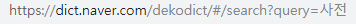
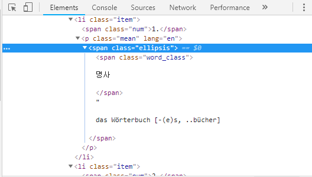

# 챗봇 기능에 사전 검색 기능 추가

- 네이버 사전의 경우 핸드폰으로 매번 앱을 시작하고 사전 탭을 찾아 들어가야 하는 번거로움이 있었다.
- 만약 telegram 챗봇에서 '사전 keyword' 형태로 별도의 앱 실행 없이 바로 사전을 이용할 수 있다면 어떨까?
- 이전에 배웠던 웹 크롤링 기술을 이용하여 네이버 사전에서 해당 표제어에 대한 검색 결과를 가져오는 것이 이번 프로젝트의 목표이다.


## 코드 작성

- 코드 작성 부분의 상당부분은 web_crawling.md를 참조하였다.



- query= 이하 부분에 검색 키워드가 들어가는 점에 착안하여 변수 설정을 다음과 같이 한다.

```python
url = 'https://dict.naver.com/dekodict/#/search?query='
word = '사전'
```



- 사전 검색 결과를 담고 있는 html 문서의 css selector는 다음과 같았다.

```python
#searchPage_entry > ul > li:nth-child(1) > ul > li:nth-child(1) > p > span
```

- 위 두 정보를 종합하여 최종적으로 작성된 코드는 다음과 같다.

```python
import requests
from bs4 import BeautifulSoup

url = 'https://dict.naver.com/dekodict/#/search?query='
word = '사전'

res = requests.get(url+word)
print(res.status_code)
soup = BeautifulSoup(res.text, 'html.parser')
result = soup.find_all('#searchPage_entry > ul > li:nth-child(1) > ul > li:nth-child(1) > p > span')
print(result)
```

> 200
>
> []

## 문제 당면

- 그러나 어쩐 이유에선지 자꾸만 결과가 빈 리스트로 출력되는 걸 알 수 있었다.
- 네트워크 연결 문제인가 해서 res.status_code로 확인해보아도 200번이 리턴되어왔다.
- 이 부분에 대한 해결은 차차 해나가도록 하겠다.