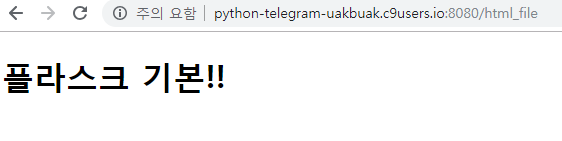
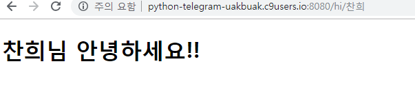
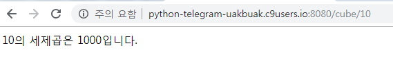
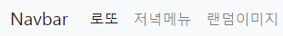
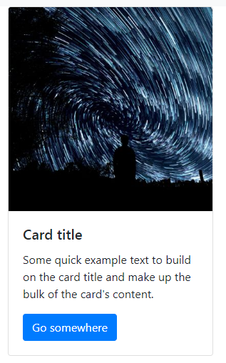
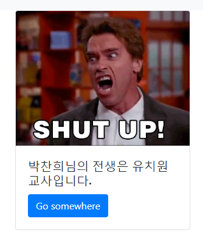

[TOC]

# 웹 프레임워크란?

------


- 이미 만들어진 프레임을 가져와 웹 서비스를 만드는 방법
  - cf) 카페를 내는데 자기가 직접 모든 걸 디자인하지 않고 가맹점을 내는 방식
- 자바에서는 Servlet(?), Spring 등이 있다.
- 파이썬에서는 쟝고, 플라스크가 있다.


## 플라스크  사용하기


#### 	app.py 파일 생성 후 다음을 작성한다.

```python
# 플라스크 사용 선언
from flask import Flask
app = Flask(__name__)

# / 를 기본 url로 경로설정 해주는 부분 (servlet mapping과 유사)
# 즉, @app.route()를 이용해 경로를 설정하고 해당 부분에 코드를 추가하면 된다.
@app.route("/")
def hello():
    return "Hello World!"

# 출처 : http://flask.pocoo.org/
```


#### 	플라스크 구동 방법

```bash
$ pip install Flask
$ FLASK_APP=app.py flask run #--host=$IP --port=$PORT C9으로 구동시
 * Running on http://localhost:5000/
```


#### 	$ python app.py 로 구동하고 싶다면 다음을 추가한다.

```python
# 서버실행 옵션
if __name__ == '__main__': # 모듈로 실행되었는지, 파일로 직접 실행되었는지 확인
    app.run(debug=True) #, host='0.0.0.0', port=8080 C9으로 구동시
```


#### 	html 태그 전송하기

- app.py

```python
@app.route("/html_tag")
def html_tag(): # 선언하는 함수명은 route값과 일치하게 주는 것이 관례
    return """
    <h1>html 태그도 전송이 가능합니다.</h1>
    <p>p 태그도 전송이 가능합니다.</p>
    """
```

> 


#### 	html 파일 전송하기

- app.py

```python
@app.route("/html_file")
def html_file():
    return render_template("html.html")
```

- html.html

```html
<!DOCTYPE html>
<html lang="en">
<head>
    <meta charset="UTF-8">
    <meta name="viewport" content="width=device-width, initial-scale=1.0">
    <meta http-equiv="X-UA-Compatible" content="ie=edge">
    <title>Document</title>
</head>
<body>
    <h1>플라스크 기본!!</h1>
    
</body>
</html>
```

> 

#### 	variable routing - 회원명

- 유동적으로 변하는 변수명을 포매팅하는 방법
- url에 입력된 parameter값을 그대로 받아온다
- app.py

```python
@app.route("/hi/<string:name>") # <데이터타입:변수명>
def hi(name):
    return render_template("hi.html", name=name)
```

- hi.html

```html
<!DOCTYPE html>
<html lang="en">
<head>
    <meta charset="UTF-8">
    <meta name="viewport" content="width=device-width, initial-scale=1.0">
    <meta http-equiv="X-UA-Compatible" content="ie=edge">
    <title>Document</title>
</head>
<body>
    <h1>{{name}}님 안녕하세요!!</h1>
</body>
</html>
```

> 


#### variable routing 2 - 세제곱

- app.py

```python
@app.route("/cube/<int:num>") #<데이터타입:변수명>
def cube(num):
    # cubic = num * num * num
    cubic = num ** 3
    return render_template("cube.html", num=num, cubic=cubic)
    # html에게 전달해줄 변수명=함수 내에서 정의된 변수명
    # request.setParameter("name", "value")와 비슷하다고 이해하면 될 듯.
```

- cube.html

```html
{{num}}의 세제곱은 {{cubic}}입니다.
```

> 

#### variable routing 3 - 저녁메뉴

- app.py

```python
@app.route("/dinner")
def dinner():
    menu_list = ["김밥까페", "시골집", "강남목장"]
    pick = random.choice(menu_list)
    return render_template("dinner.html", pick=pick)
```

- dinner.html

```html
오늘 저녁은 {{pick}} 에서 먹자!
```


> ​		 

#### variable routing 4 - 로또번호

- import 할 것

```python
import random
```

- app.py

```python
@app.route("/lotto")
def lotto():
    numbers = range(1, 46)
    pick = random.sample(numbers, 6)
    return render_template("lotto.html", pick=pick)
```

- lotto.html

```html
행운의 번호는 {{pick}} 입니다!
```


> 

#### 랜덤이미지 가져오기

```python
@app.route("/random_img")
def random_img():
    return render_template("random_img.html")

# templates/random_img.html 파일을 다음과 같이 작성한다.

# picsum은 랜덤하게 이미지를 가져오게 해주는 링크를 제공한다.
# cf) ipsum lorem
```


#### base 파일을 이용해 기본탭 만들기

- base.html을 다음과 같이 작성한다.

```html
<!DOCTYPE html>
<html lang="en">
<head>
    <meta charset="UTF-8">
    <meta name="viewport" content="width=device-width, initial-scale=1.0">
    <meta http-equiv="X-UA-Compatible" content="ie=edge">
    <title>Document</title>
</head>
<body>
    <a href="/lotto">로또</a>
    <a href="/dinner">저녁메뉴</a>
    <a href="/random_img">랜덤 이미지</a>
    
    
    
    
</body>
</html>
```

- lotto.html과 dinner.html에 다음을 추가한다.

```html


<h1>행운의 번호는 {{pick}} 입니다!</h1>

```

> 

- 링크를 클릭할 때마다 해당 html파일이 불러오기 된다.

#### bootstrap 적용하기

- base.html을 다음과 같이 수정한다.

```html
<!DOCTYPE html>
<html lang="en">
<head>
    <meta charset="UTF-8">
    <meta name="viewport" content="width=device-width, initial-scale=1.0">
    <meta http-equiv="X-UA-Compatible" content="ie=edge">
    <title>Document</title>
    <link rel="stylesheet" href="https://stackpath.bootstrapcdn.com/bootstrap/4.3.1/css/bootstrap.min.css" integrity="sha384-ggOyR0iXCbMQv3Xipma34MD+dH/1fQ784/j6cY/iJTQUOhcWr7x9JvoRxT2MZw1T" crossorigin="anonymous">
</head>
<body>
    <a href="/lotto">로또</a>
    <a href="/dinner">저녁메뉴</a>
    <a href="/random_img">랜덤 이미지</a>
    
    
    
    <script src="https://code.jquery.com/jquery-3.3.1.slim.min.js" integrity="sha384-q8i/X+965DzO0rT7abK41JStQIAqVgRVzpbzo5smXKp4YfRvH+8abtTE1Pi6jizo" crossorigin="anonymous"></script>
    <script src="https://cdnjs.cloudflare.com/ajax/libs/popper.js/1.14.7/umd/popper.min.js" integrity="sha384-UO2eT0CpHqdSJQ6hJty5KVphtPhzWj9WO1clHTMGa3JDZwrnQq4sF86dIHNDz0W1" crossorigin="anonymous"></script>
    <script src="https://stackpath.bootstrapcdn.com/bootstrap/4.3.1/js/bootstrap.min.js" integrity="sha384-JjSmVgyd0p3pXB1rRibZUAYoIIy6OrQ6VrjIEaFf/nJGzIxFDsf4x0xIM+B07jRM" crossorigin="anonymous"></script>
</body>
</html>
```

- css는 페이지가 불러와진 직후에, jss는 페이지 로딩이 끝난 후에 적용되는 게 좋기 때문에 css 코드는 head에, jss 코드는 body에 작성한다.

#### navbar 적용하기

```html
<nav class="navbar navbar-expand-lg navbar-light bg-light">
      <a class="navbar-brand" href="#">Navbar</a>
      <button class="navbar-toggler" type="button" data-toggle="collapse" data-target="#navbarNav" aria-controls="navbarNav" aria-expanded="false" aria-label="Toggle navigation">
        <span class="navbar-toggler-icon"></span>
      </button>
      <div class="collapse navbar-collapse" id="navbarNav">
        <ul class="navbar-nav">
          <li class="nav-item active">
            <a class="nav-link" href="/lotto">로또</a>
          </li>
          <li class="nav-item">
            <a class="nav-link" href="/dinner">저녁메뉴</a>
          </li>
          <li class="nav-item">
            <a class="nav-link" href="/random_img">랜덤이미지</a>
          </li>
        </ul>
      </div>
    </nav>

<!-- 기존의 base.html의 a태그를 지우고 다음과 같이 수정한다. -->
```

> 

#### 이미지 카드로 바꾸기

```html


    <div class="card" style="width: 18rem;">
      
      <div class="card-body">
        <h5 class="card-title">Card title</h5>
        <p class="card-text">Some quick example text to build on the card title and make up the bulk of the card's content.</p>
        <a href="#" class="btn btn-primary">Go somewhere</a>
      </div>
    </div>


<!-- 기존의 random_img.html을 다음과 같이 수정한다. -->
```

> 

#### 이미지 가운데 정렬하기

```html
<div class="container d-flex justify-content-center">
        
        
        
</div>

<!-- 기존의 base-html의 내용 부분을 다음과 같이 수정하면 가운데 정렬이 적용된다.-->
```

- [플렉스 태그 연습하기](https://flexboxfroggy.com/#ko)

#### 전생의 직업 알아보기

- import 해야할 것

```python
from faker import Faker
import requests
```

- app.py를 다음과 같이 수정

```python
@app.route("/ego/<string:name>")
def ego(name):
    url = "http://api.giphy.com/v1/gifs/search?api_key=xWsN9spauUQ86kH9uaEyz9khJrKKz7PT&q="
    fake = Faker("ko_KR")
    job = fake.job()
    res = requests.get(url+job).json() # json 형태의 데이터를 딕셔너리로 바꾸어주는 역할
    img_url = res["data"][0]["images"]["original"]["url"]
    return render_template("ego.html", img_url=img_url, name=name, job=job)
```

- ego.html

```html



    <div class="card" style="width: 18rem;">
      
      <div class="card-body">
        <h5 class="card-title">{{name}}님의 전생은 {{job}}입니다.</h5>
        <a href="#" class="btn btn-primary">Go somewhere</a>
      </div>
    </div>

```

> 

- fake.job()을 통해서 임의의 직업을 가져온다.
- 가져온 직업을 query로 이용해서 giphy라는 gif 사이트에 검색한다.
- 검색한 페이지(json 파일)에서 가져오고 싶은 이미지 url을 가져온다.
- img src에 해당 url을 입력해준다.