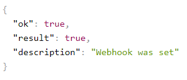
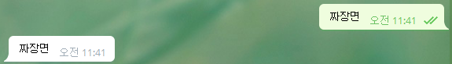
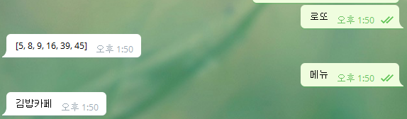
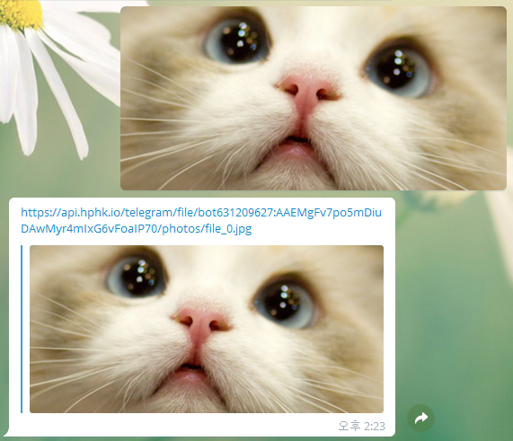
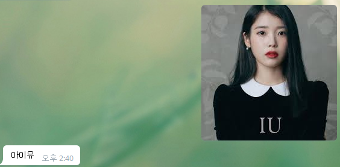

# Telegram을 이용해 chatbot 만들기

- Telegram을 설치하고 BotFather을 추가, 새로운 chatbot을 생성한다.
- message.py를 다음과 같이 작성한다.

```python
import requests

token = "###"
chat_id = "###"
# url = f"https://api.telegram.org/bot{token}/sendMessage?chat_id={chat_id}&text=안녕하세요"
url = f"https://api.hphk.io/telegram/bot{token}/sendMessage?chat_id={chat_id}&text=안녕하세요"

res = requests.get(url)
print(res)
# print(url)
```

> 안녕하세요

- c9에서 작업할 경우 chatbot 생성을 막아놓았기 때문에 경로를 api.telegram.org로 작성하면 실행되지 않는다.
- 따라서 우회하는 url을 작성하여 실행한다.
- 지난번에 배웠던 챗봇 기능들을 하나씩 추가해보도록 하자.


## token값 환경변수로 지정하기

- github에 token, api key 등을 사용하게되면 유출될 가능성이 있으므로 감춰두는게 좋다.
- vi로 bashrc 파일을 실행한다.
- 마지막줄에 다음을 추가한다.

```bash
export TELE_TOKEN="###"
```

- 이를 통해 해당 컴퓨터가 아니면 token값을 이용할 수 없게 만들 수 있다.

- 다시 app.py로 돌아와 다음과 같이 token 값을 지정해준다.

```python
import os
token = os.getenv("TELE_TOKEN")
```

- 설정을 마친 후엔 bash로 꼭 다음 명령어를 수행해주어야 한다.

```bash
$ exec $SHELL
$ echo $TELE_TOKEN
```

- echo 명령어를 수행했을 때 입력한 token값이 반환되면 성공적으로 설정된 것이다.


## 코스피 지수 가져오기

- 다음 내용을 추가해보자.

```python
from bs4 import BeautifulSoup

url = f"https://api.hphk.io/telegram/bot{token}/sendMessage?chat_id={chat_id}&text="

sise_url = "https://finance.naver.com/sise/"
sise_html = requests.get(sise.url).text
sise_soup = BeautifulSoup(sise_html, "html.parser")
sise = sise_soup.select("#KOSPI_now").text

res = requests.get(url+sise)
```

> 2,229.36


## 로또 기능 추가하기

- 다음 코드로 간단하게 로또번호도 전송할 수 있다.

```python
import random

lotto = str(random.sample(range(1, 46), 6))
res = requests.get(url+lotto)
```


## app.py로 flask 구성하기

- 지금까지 일방적으로 메시지를 보내는 기능을 구현했다면, 이제는 통신을 통해 메시지를 주고받는 기능을 구현할 것이다.
- app.py 파일을 작성한 뒤 다음과 같이 작성한다.

```python
from flask import Flask
app = Flask(__name__)

@app.route("/")
def hello():
    return "Hello World!"
    
if __name__ == "__main__" :
    app.run(host="0.0.0.0", port=8080)
```

- 요청 받은 명령어에 대해서 특정 함수를 실행하려면 우선 telegram으로부터 요청받았다는 사실을 c9 서버로 알려야 한다.
- 이를 web hook이라고 한다.
- https://api.telegram.org/bot<token값>/setWebhook?url=<서버주소>/<token값> 명령을 url로 수행하자.
- 이때 서버주소는 http를 https로 수정하고, 포트번호를 지워주어야 한다.



- 이런 json 파일을 받았다면 성공적으로 webhook이 만들어진 상태이다.

```python
@app.route(f"/{token}", methods=["POST"])
def telegram():
    msg_info = request.get_json()
    chat_id = msg_info.get("message").get("from").get("id")
    text = msg_info.get("message").get("text")
    
    return_url = f"{api_url}/bot{token}/sendMessage?chat_id={chat_id}&text={text}"
    requests.get(return_url)
    
    return '', 200
```

> 

- 이제 이런 식으로 루트를 추가하면 보내는 메시지에 똑같이 답하는 기능이 추가되는 것을 볼 수 있다.


## 응답형 기능 추가하기

- 다음 코드를 추가하면 "로또"와 "메뉴" 명령어에 대한 대답을 수행한다.

```python
 if text == "로또":
        return_text = sorted(random.sample(range(1, 46), 6));
elif text == "메뉴":
        menu_list = ["양자강", "명동칼국수", "김밥카페", "시골집"]
        return_text = random.choice(menu_list)
else:
        return_text = "없는 명령어입니다."
```




## naver API 연동하기

### 		파파고 기능 추가하기

- naver api 중 얼굴 인식과 파파고 번역기능을 추가하려고 한다.
- client ID와 secret key를 발급받은 후 token처럼 환경변수에 추가하자.

```bash
export NAVER_ID="###"
export NAVER_SECRET="###"
```

- 설정을 마친 후엔 bash로 꼭 다음 명령어를 수행해주어야 한다.

```bash
$ exec $SHELL
$ echo $TELE_TOKEN
```

- echo 명령어를 수행했을 때 입력한 token값이 반환되면 성공적으로 설정된 것이다.


- 네이버 NMT 파파고 기능의 요청 url은 다음과 같다.

> ```
> curl "https://openapi.naver.com/v1/papago/n2mt" \
> -H "Content-Type: application/x-www-form-urlencoded; charset=UTF-8" \
> -H "X-Naver-Client-Id: nqw3ztlyPfu61g0wwrdU" \
> -H "X-Naver-Client-Secret: 9KsOLltAbk" \
> -d "source=ko&target=en&text=만나서 반갑습니다." -v
> ```

- 위 요청 방식은 ? 뒤에 파라미터값을 주는 get방식과는 다르게 post방식으로 보내고 있다.
- 다음 코드를 추가하면 이 형식에 맞게 api에게 요청을 보낼 수 있다.

```python
elif text[0:3] == "번역 ":
        headers = {
            "X-Naver-Client-Id":naver_id,
            "X-Naver-Client-Secret":naver_secret
        }
        naver_url = "https://openapi.naver.com/v1/papago/n2mt"
        data = {
            "source":"ko",
            "target":"de",
            "text":text[3:]
        }
        papago = requests.post(naver_url, headers=headers, data=data)
        #print(papago.text) => json 형태의 객체 return
        return_text = papago.json().get("message").get("result").get("translatedText")
```

- requests.post로 가져온 papago라는 객체를 json(딕셔너리 형태)로 바꿔주어야 우리가 필요로 하는 데이터를 가져올 수 있다.
- 딕셔너리 형태의 객체는 .get("key값")을 통해서 추려낼 수 있다.
- papago.json() 객체는 다음과 같이 구성되어 있다.

> {"message":
>
> ​	{"@type":"response",
>
> ​	"@service":"naverservice.nmt.proxy",
>
> ​	"@version":"1.0.0",
>
> ​	"result":
>
> ​		{"srcLangType":"ko",
>
> ​		"tarLangType":"de",
>
> ​		"translatedText":"Guten Tag."}
>
> ​	}
>
> }


### 	얼굴 인식 기능 추가하기

- 이미지 인식을 위해서 if문에 분기점을 하나 추가해주어야 한다.

- 큰 가지가 이미지가 있을 때 / 이미지가 없을 때 로 구분되는 것을 볼 수 있다.

```python
if msg_info.get("message").get("photo") is not None: # 사진이 있을 때
        pass
    else: # 사진이 없을 때
        if text == "로또": 
            #...
```

- 분기로 만든 if문 안에서 이미지 파일의 id값을 받아와서 이를 url로 변환하는 작업을 거쳐야 한다.

```python
if msg_info.get("message").get("photo") is not None: # 사진이 있을 때
        file_id = msg_info.get("message").get("photo")[-1].get("file_id")
        file_res = requests.get(f"{api_url}/bot{token}/getFile?file_id={file_id}")
        file_path = file_res.json().get("result").get("file_path")
        file_url = f"{api_url}/file/bot{token}/{file_path}"
        return_text = file_url
```

- 다음 과정을 거치면 사진을 보냈을 때 이 사진을 고스란히 return해주는 것을 볼 수 있다.

- file_res.json() 객체는 다음과 같이 구성돼있다.

> {"ok":true,
>
> "result":
>
> ​	{"file_id":"AgADBQADiqgxG1JfuFdkmbQuSKTBHv3w3zIABKpdMtXxdEWRQmYBAAEC",
>
> ​	"file_size":35966,
>
> ​	"file_path":"photos/file_0.jpg"}
>
> }



- 이제 이를 다운로드 받아 clova(얼굴인식 api)로 보내줄 것이다.

```python
real_file = requests.get(file_url, stream=True)
        headers = {
                "X-Naver-Client-Id":naver_id,
                "X-Naver-Client-Secret":naver_secret
        }
        naver_url = "https://openapi.naver.com/v1/vision/celebrity"
        clova = requests.post(naver_url, headers=headers, files={"image":real_file.raw.read()})
        
        if clova.json().get("info").get("faceCount"): # 사람이 인식될 때
            clova_return = clova.json().get("faces")[0].get("celebrity")
            return_text = f"{clova_return.get('value')}"
        else: # 사람이 인식되지 않을 때
            return_text = "사람이 인식되지 않습니다."
```

> 

- 적중률은 크게 높지 않은 것으로 보인다.

