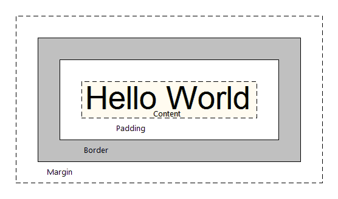

# CSS

- 특정 태그에 스타일을 입히고 싶을 때 사용한다.

> span { color : red}
>
> 태그 { 속성 : 값 }


## 적용 방법

- 우선 순위는 inline -> internal -> external 순으로 적용된다.


### inline

```html
<p style="color:blue;">
    contents
</p>
```

- body 태그 안에다 적용
- 가장 먼저 적용되게 된다.
- html 내부에 작성하는 것은 좋은 구조가 아니다.


### internal

```html
<style>
    div > p {
        color : blue;
    }
</style>
```

- head 안에 style 태그를 적용시키는 것
- 별도의 css 파일을 불러오지 않아도 된다는 장점이 있다.
- 그로 인해 요청을 부가적으로 보내지 않아도 된다.


### external

```html
# main.css 
div > p {
	color : red;
}

# index.html
# head 태그 내에 삽입한다.
<link rel = "stylesheet" href="main.css">
```

- *.css 파일을 작성하여 html에서 불러오는 것.
- html 파일 내부 코드가 단순해지는 장점이 있다.
- 유지/보수에 유리하다.


## 상속

- 상위에 설정된 스타일을 하위에서 사용한다
- 코드 재사용
- 가령 div 태그에 대해서 스타일을 적용한다면, 하위 태그에도 모두 적용된다.
- 그러나 박스 모델에서 마진, 보더, 패딩과 같은 속성(배치에 관련된 속성들)은 정확히 지정한 태그에만 적용된다.
- box-model에 해당되는 속성들
  - width : 가로 길이
  - height : 세로 길이
  - margin : 외부 여백
  - padding : 내부 여백
  - border : 경계 표시


### css 적용 우선순위

- 적용 방식에 따라 inline > internal = external 의 순서로 적용된다.
- 속성값에 따라 id > class > element(태그 종류) 순으로 적용된다.
- 부등호의 의미는, 가장 강력하게 작용한다는 것이다. 즉, 중복되는 css값이 있다고 하더라도 부등호의 가장 좌변에 있는 값이 우선하여 적용된다는 의미이다.


## 수치의 방향성

```css
margin : 1 30px;
margin : 0 0 0 5px;
padding : 5px;
padding : 10 0 5px;
```

- 마진과 패딩은 다음과 같이 여러 속성값을 부여할 수 있다.
- 이때 기본적으로 **상->우->하->좌**의 순서로 적용된다.
- 만약 1번째 코드처럼 두 개의 값만 있다면, **상->우**에 대해서만 적용된다.
- 만약 하나의 값만 주어진다면 모든 경우에 동일하게 적용된다.


## css selector

- tag, id, class, html 태그 속성들을 이용해 요소를 찾아내는 방식
- 3가지 기본 선택자(태그, 아이디, 클래스)를 사용 가능하다.
- 태그는 단순히 **태그명**으로 지정한다.
- 아이디는 **#아이디명** 로 지정한다.
- 클래스는 **.클래스명** 로 지정한다.
- css에서는 id를 여러 개 속성에 부여해도 해당 id에 모두 적용되지만, 하나의 엘리먼트에만 부여하는 것이 바람직하다.
- 여러 그룹을 지정하고 싶을 때는 ,로 구분한다
- 하위 속성을 선택하고 싶을 때는 띄어쓰기로 선택한다.
- 한편 >를 사용하면 해당 속성의 첫 번째 자식에만 적용된다.
- n번째 자식요소를 선택하려면 (nth-child)로 찾는다.
- 특정 태그의 n번째 자식요소를 선택하려면 (nth-of-type)을 이용한다.

```html
<style>
    #test > p:nth-chile(2) {
        color : red
    }
</style>

<div id="test">
    <h2>단락 선택</h2>
    <p>첫번째 단락입니다.</p>
    <p>두번째 단락입니다.</p>    
    <p>세번째 단락입니다.</p>
    <p>네번째 단락입니다.</p>
</div>
```

> 두번째 단락입니다. 부분이 붉은색으로 표시된다.

- nth-child(an+b)와 같은 셀렉팅도 가능하다.
  - a와 b는 모든 정수이다.
  - n에는 0, 1, 2, 3, ... 의 정수가 차례로 대입된다.
- nth-child(even/odd)를 사용하면 짝수/홀수번째 자손을 선택할 수 있다.


## 폰트, 백그라운드 설정

- color
  - rgb(r, g, b)로 rgb 좌표를 부여할 수 있다.
  - #ff0000 처럼 16진수 좌표를 부여할 수 있다.
  - 혹은 단순히 색깔 이름을 지정할 수도 있다.
- font-size
  - 16px
  - 1em (상속된 상위 태그 폰트 크기 기준 n배수)
    - 폰트의 기본 설정 크기는 16px이다
    - 2em = 32px
    - 만약 부모 노드의 폰트가 32px라면 2em은 64px이다.
- font-family
  - Gulim,monospace, sans-serif 등 폰트명 지정

- background-color
  - 배경색 지정하기
  - color값과 유사하게 지정한다.
- background-image
  - url("파일 경로")
  - linear-gradient(top to bottom)
    - 최소 두 개의 색상을 지정하여 선형 그라데이션 효과를 추가한다.
  - radial-gradient(center to edges)
    - 최소 두 개의 색상을 지정하여 원형 그라데이션 효과를 추가한다.

- background-position
  - left, right, top, bottom, center
- background-repeat
  - repeat : 가로, 세로 방향으로 반복
  - no-repeat : 반복하지 않는다.
  - repeat-x(y) : 가로(세로)방향으로 반복
- background-size
  - auto : 자동 설정
  - length(가로, 세로) : px값으로 지정
  - percentage(가로, 세로) : 퍼센트 상대비로 지정
  - cover : 배경 이미지를 컨테이너 전체를 덮도록 재조정
  - contain : 이미지 전체가 확실히 보이도록 재조정


## 배치 방식

- 엘리먼트를 배치하는 작업을 layout 작업, rendering 과정이라고도 한다.


### display

- block : 무조건 한 줄을 사용한다. 벽돌을 쌓듯이 위에서 아래로 쌓인다.
- inline : 기본적으로 span 태그와 같다. 텍스트가 왼쪽에서 오른쪽으로 흐르지만, 높이와 넓이는 반영할 수 없다. 텍스트 내 특정 부분에만 스타일을 줄 때 사용할 수 있다.
- inline-block : 인라인의 단점을 보완한 기능으로, width/height, margin/padding, line-height가 지정 가능하다.


### position 

- static : 기본 속성. 순서대로 배치된다.
- absolute : top/left/right/bottom으로 설정한다. 기준점은 상위 엘리먼트 중 static 아닌 position을 따른다. (top/left 값은 0이라도 적어주는 것이 좋다) 만약 해당 상위 엘리먼트가 없으면 body를 기준으로 삼는다.
- relative : top/left/right/bottome으로 설정한다. 원래 자신이 위치해야할 곳을 기준으로 이동한다.
- fixed : viewport(전체화면). 좌측,맨위를 기준으로 동작한다.

** margin : 주변 엘리먼트와 본인 사이의 간격 (margin-top/left/right/bottom)


### float

- left
- right

주위 엘리먼트들의 flow를 따르지 않고 예외적 위치에 배치된다. -> 페이지의 좌우 배치에 활용된다.


## css 박스 모델

> 

- margin : 엘리먼트 간의 간격
- border : 컨텐츠 경계를 이루는 테두리
- padding : 컨텐츠와 보더 사이의 경계


## 엘리먼트의 크기

- block 엘리먼트는 기본적으로 부모의 크기만큼을 가진다.
- padding 속성을 늘리면 엘리먼트의 크기 자체가 달라질 수 있다. 이를 방지하기 위해서는 box-sizing을  content-box(기본값)이 아닌 border-box(테두리)으로 변경하면 된다. 그러면 박스의 크기가 비교적 잘 유지된다.


## 참조 링크

> - css 치트 시트
>
> https://gist.github.com/magicznyleszek/809a69dd05e1d5f12d01
>
> - gradient 속성 정보
>
> http://tcpschool.com/css/css3_module_linearGradients