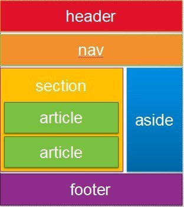

# HTML 

## 태그의 의미와 종류

태그를 본래 쓰임에 맞지 않게 써도 문제 없을 수 있지만, 본래 태그가 지니는 기능을 사용하지 못하는 경우(ex) 시각장애인용 태그), 웹 크롤링을 통해 특정 정보를 찾는 경우 등 여러 불편함이 생길 수 있으므로 쓰임에 유의하도록 한다.

### 기본 태그

- !DOCTYPE : 문서 타입
- html  : HTML 문서의 시작과 끝 설정
- head : 문서에 대한 정보를 담는 머리말
- meta : 문서에 대한 일반적 정보 기술
- title : 문서의 제목
- body  : 문서의 내용 부분
- h1-h6 : 제목 글자 표현
- p : 문단부
- br : 줄 삽입
- hr : 수평선 삽입
- !-- -- : 주석문

### 포매팅 태그

- strong : 강조 표시
- b : 볼드체로 표시

### 폼/인풋 태그

- form : 입력할 수 있는 양식 생성
- input : 선택할 수 있는 양식 생성
- textarea : 여러 줄 입력 가능한 텍스트 상자
- button : 클릭 가능한 버튼
- select : 드롭다운 형식의 리스트
- option : 드롭다운 리스트의 개체 지정

### 리소스

- img : 이미지 생성
- audio : 오디오 생성
- video : 비디오 생성

### 링크

- a : 하이퍼링크 정의

### 리스트

- ul : 점으로 구분되는 리스트
- ol : 숫자로 구분되는 리스트
- li : 리스트에 해당하는 개체

### 표

- table : 표 생성
- th  : 표 제목 설정
- tr : 열 생성
- td : 행 생성

### 스타일/구조

- style : css 스타일 지정
- div : 문서의 영역 지정
- span  : 문서의 영역 지정

### 레이아웃

- 블록 엘리먼트라고도 한다. 영역을 지정하기 위해 사용한다. 즉, 역할이 div 태그와 유사하다.
- div 태그 내에 class를 해당 태그명으로 지정하는 방법도 있다.

>  

- header : 맨 위 영역 생성
- section : 본문 영역 생성
- nav : 메뉴 영역 생성
- footer : 맨 밑 영역 생성
- aside : 측면

