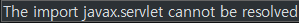

# errors

## javax.servlet 임포트 오류

> 

- 이클립스에서 서블릿을 생성하자 다음과 같은 오류가 발생하였다.
- 프로젝트 내부에 서블릿을 인식하는 라이브러리가 설정되지 않으면 이와 같은 오류가 발생한다.
- 해결 방법은 다음과 같다.

> 프로젝트 우클릭 -> Build Path -> Configure Build Path -> libraries 탭 -> Add Library -> Server Runtime -> Apache Tomcat v8.0

- 서블릿은 서버와의 통신이 가능해야하기 때문에 서버를 제공하는 WAS의 라이브러리가 등록돼있어야만 이를 사용할 수 있는 것으로 보인다.

## 'xx cannot be resolved 오류'

- 이클립스 내 변수 설정이 잘못되어 발생하는 오류이다.
- 해결 방법은 둘 중 하나이다.
  1. ctrl + sft + o 를 통해 import를 갱신해준다.
  2. 지정 변수가 선언되어있는지 확인한다.(오타 체크)

## css 반영 오류

- 가끔 css를 변경했을 때 변동사항을 브라우저에서 인식하지 못하는 경우가 있다. 이럴 때는 F5를 아무리 연타해봐야 적용되지 않고, 심지어 브라우저를 껐다가 켜봐도 그대로인 경우가 발생한다.
- 크롬 설정 - 고급 - 인터넷 사용 기록 삭제 - 캐시된 이미지 또는 파일 삭제 기능으로 다음을 해결할 수 있다.
- 물론 이는 css파일이 바뀔 때마다 삭제해주어야 한다는 번거로움이 존재한다.
- 이를 방지하는 방법으로 파일 내 자체적으로 css 파일을 갱신해주는 방법이 존재한다.

> 

- 일반적으로 html에서 css 파일을 불러오는 링크는 다음과 같다. 이때 href의 URI 뒷편에 '?ver=1'을 적어준다.

> 

- 이러면 캐시된 파일이 아니라 위 쿼리가 포함된 파일을 그때마다 실행시키기 때문에 지연이 발생하지 않는다.
- JS파일도 마찬가지로 src 속성값의 URL 뒤에 '?ver=1' 쿼리를 부착함으로써 지연을 방지시킬 수 있다.