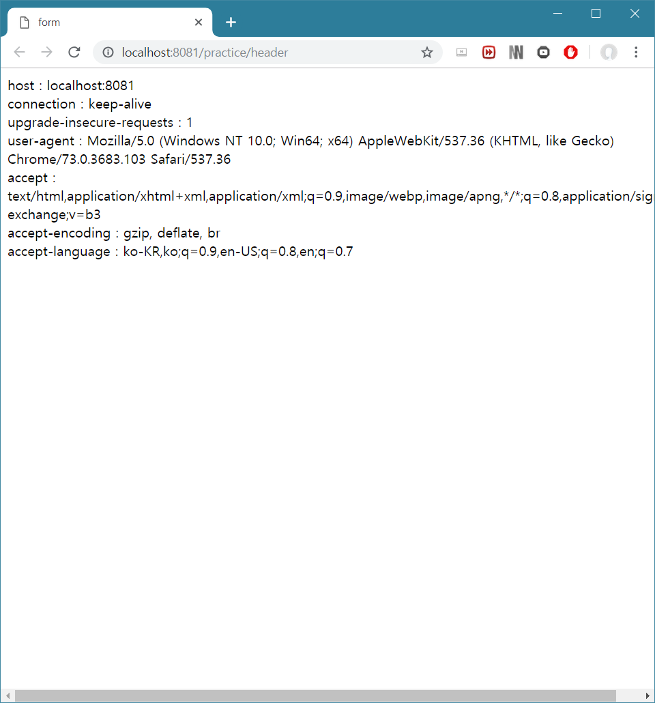

# Servlet


## 자바 웹 어플리케이션

- WAS에 설치되어 동작하는 어플리케이션
- HTML, CSS, 이미지, 자바로 작성된 클래스(servlet, package, interface 등), 각종 설정 파일 등이 포함된다.
- 인터넷에서 사용하는 쇼핑몰 사이트 등이 웹 어플리케이션이다.


### 구조

- WAS에 의해 동작하는 웹 어플리케이션은 특정 파일 구조를 따른다.
- 이와 같은 tree 구조를 확인하려면 워크스페이스 내 .metadata > .plugins > org.eclipse.wst.server.core > tmp0 > wtpwebapps > 해당 package로 들어가면 볼 수 있다.


#### WEB-INF 폴더

- 반드시 있어야 하는 폴더.
- **web.xml**이라는 파일이 존재 (배포 기술자. servlet 3.0 미만에서는 필수, 이후는 어노테이션 사용)
- lib 폴더 -> jar 파일들 수록
- classes 폴더 -> java 패키지, class들 포함


#### Resources 폴더

- 각종 폴더, 이미지, 리소스들
- html, css, java-script 등(프론트 기반)이 수록


## servlet이란?

- 자바 웹 어플리케이션의 구성요소 중 동적인 처리를 하는 프로그램의 역할

- WAS에서 동작하는 Java 클래스

- HttpServlet 클래스를 상속받아야 한다.

- 서블릿과 JSP로부터 최상의 결과를 얻으려면, 웹 페이지를 개발할 때 이 두가지를 조화롭게 사용하는 것이 좋다.

  ex) 웹 페이지를 구성하는 화면은 JSP로, 복잡한 프로그래밍은 서블릿으로 구현

- 동적 구성이라고 하는 이유는, 이미 만들어져 있는 페이지를 클라이언트에게 제공(html)하는 것이 아니라, 요청이 들어왔을 시에만 필요한 정보를 제공한다는 점에서 그러하다.


## servlet 작성하기

1. 3.0 이상

- web.xml 파일을 사용하지 않고 자바 어노테이션을 사용한다.

  ex) @WebServlet("/helloservlet")

- 단 spring과 같은 프레임워크를 사용할 때는 3.0 이상이라 하더라도 web.xml 파일이 필요할 수 있다.

- 어노테이션을 적용하면 URL이 다음과 같이 설정되는 것을 알 수 있다.

> ip주소:포트번호/패키지명/맵핑값
>
> localhost:8081/practice/helloservlet


2. 3.0 미만

- web.xml 파일에 mapping 해주어야 한다.
- 맵핑 양식은 다음과 같다. 

```markup
<servlet>
        <description></description>
        <display-name>실제 서블릿명</display-name>
        <servlet-name>실제 서블릿명</servlet-name>
        <servlet-class>패키지명.실제 서블릿명</servlet-class>
    </servlet>
    <servlet-mapping>
        <servlet-name>실제 서블릿명</servlet-name>
        <url-pattern>/원하는 맵핑 주소/url-pattern>
    </servlet-mapping>
```


## servlet의 생명 주기

1. 메모리에 해당 servlet이 있는지 확인 (요청 객체가 있다면-> service만 호출)
2. 없다면 생성자 메소드와 init 메소드 호출
3. 최초 요청 + 새로고침 시마다 service 메소드 호출
4. WAS가 종료되거나 웹 어플리케이션이 새롭게 갱신되면 destroy 메소드로 해당 servlet을 메모리에서 제거한다.


### service(request, response) 메소드

- HttpServlet의 service 메소드는 템플릿 메소드 패턴으로 구현된다.
- 즉, service를 override하지 않았다면 상위 클래스의 service 메소드를 상속
  - 클라이언트의 요청이 GET일 경우 자신이 가지고 있는 doGet 메소드 호출
  - 클라이언트의 요청이 POST일 경우 자신이 가지고 있는 doPost 메소드 호출


## request와 response

1. 웹 브라우저가 WAS에게 servlet 요청을 받는다.
2. WAS는 HttpServletRequest/HttpServletResponse 객체를 생성한다.
3. WAS는 생성된 두 요청/응답 개체를 servlet으로 전달한다.

4. 웹 어플리케이션에서 servlet을 구현한다.


### HttpServletRequest

- http 프로토콜의 request 정보를 전달하기 위함
- 헤더 정보, 파라미터, 쿠키, URI, URL 등의 정보를 읽어 들이는 메소드를 가지고 있다.
- Body의 Stream을 읽어 들이는 메소드를 가지고 있다.


### HttpServletResponse

- WAS는 어떤 클라이언트가 요청을 보냈는지 알고 있다.
- 해당 클라이언트에게 응답을 보내기 위한 response 객체를 생성한다.
- 서블릿은 해당 객체를 이용하여 content type, 응답 코드, 응답 메시지 등을 전송한다.


## header 정보 파악하기

- HeaderServlet.java를 서버에서 수행하면 다음과 같은 결과물이 return 된다. 



- 아래 내용 중 요청 헤더에 해당된다.


### 공통 헤더

1. Date : http 메시지가 만들어진 시각
2. Connection : 기본적으로 keep-alive. 중요한 의미는 없다.
3. Content-Length : 요청/응답 메시지의 본문 크기를 바이트 단위로 표시한다.
4. Content-Type : 컨텐트 타입과 문자열 인코딩을 명시할 수 있다.
5. Content-Language : 사용자의 언어를 뜻한다.
6. Content-Encoding : 컨텐트 압축 방식이다.


### 요청 헤더

1. Host : 서버의 도메인 네임(포트 포함)이 나타나는 부분.
2. User-Agent : 현재 사용자가 어떤 클라이언트를 이용했는지 알려준다.
3. Accept : 요청을 보낼 때 서버에서 이런 타입의 데이터를 보내줬으면 좋겠다고 명시할 때 사용한다.
   - Accept: text/html
   - Accept: image/png, image/gif
   - Accept: text/*
   - Accept-Charset: utf-8
   - Accept-Language: ko, en-US
   - Accept-Encoding: br, gzip, deflate
4. Authoriziation : 인증 토큰을 서버로 보낼 때 사용하는 헤더이다. API 요청 시 요구된다.
5. Origin : Post와 같은 요청을 보낼 때 요청이 시작된 주소를 알려준다.
6. Referer : 이전 페이지의 주소가 담겨 있다.


### 응답 헤더

1. Access-Control-Allow-Origin : 요청을 보내는 프론트 주소와 받는 백엔드 주소가 다를 시 CORS 에러가 발생하는데, 이때 위 헤더에 프론트 주소를 적어주면 된다.
2. Allow : get만 받을지 post만 받을지 정할 수 있다.
3. Content-Disposition : 응답 본문을 브라우저에 어떻게 표현할 것인지 알려준다.
   - Content-Disposition: inline -> 웹페이지 화면에 표시
   - Content-Disposition: attachment; filenmae='filename.csv' -> 다운로드시킨다.
4. Location : 300번대/201 응답 시 해당 주소로 리다이렉트 한다.
5. Content-Security-Policy : 다른 외부 파일을 불러오는 경우 차단할 소스와 불러올 소스를 명시한다.
   - Content-Security-Policy: default-src 'self' -> 자신 도메인의 파일들만 허용
   - Content-Security-Policy: default-src https: -> https를 통해서만 파일 허용
   - Content-Security-Policy: default-src 'none' -> 허용 안함


## 파라미터 읽어오기

- URL 이후에 오는 ? 다음에는 parameter1=값&parameter2=값 ... 형태로 get 요청을 보낼 수 있다.
- http의 form 태그를 이용하여 쉽게 이러한 parameter 값을 넘겨줄 수 있다.


## 그 외의 정보 읽어오기

```http
@WebServlet("/info")
public class InfoServlet extends HttpServlet {
	private static final long serialVersionUID = 1L;

	protected void doGet(HttpServletRequest request, HttpServletResponse response) throws ServletException, IOException {
		response.setContentType("text/html");
		PrintWriter out = response.getWriter();
		out.println("<html>");
		out.println("<head><title>info</title></head>");
		out.println("<body>");

		String uri = request.getRequestURI();
		StringBuffer url = request.getRequestURL();
		String contentPath = request.getContextPath();
		String remoteAddr = request.getRemoteAddr();
		
		
		out.println("uri : " + uri + "<br>");
		out.println("url : " + url + "<br>");
		out.println("contentPath : " + contentPath + "<br>");
		out.println("remoteAddr : " + remoteAddr + "<br>");
		
		out.println("</body>");
		out.println("</html>");
	}
}
```

- 위 코드(InfoServlet.java)를 실행시키면 다음과 같은 결과가 return 된다.

> uri : /practice/info
> url : http://localhost:8081/practice/info
> contentPath : /practice
> remoteAddr : 0:0:0:0:0:0:0:1

- URI는 URL에서 포트번호 이후 부분을 말한다.
- contentPath는 웹 어플리케이션과 맵핑된 path를 의미한다. 지정하지 않으면 project 이름으로 설정된다.
- remoteAddr은 클라이언트의 주소값이다. 로컬로 접속하면 0:0:0:0:0:0:0:1 으로 나오게 된다. 이외에는 IP 주소가 나온다.

