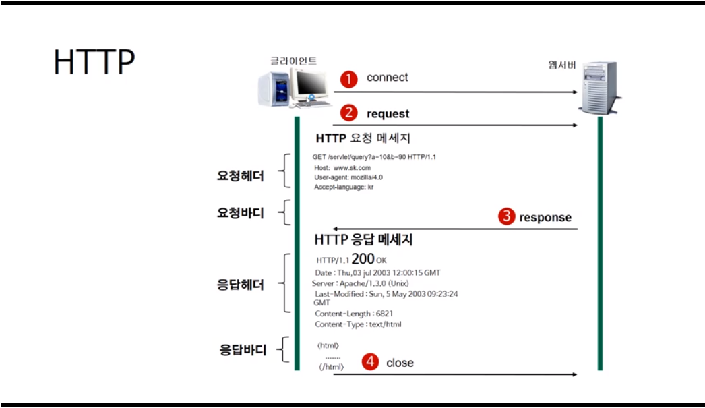
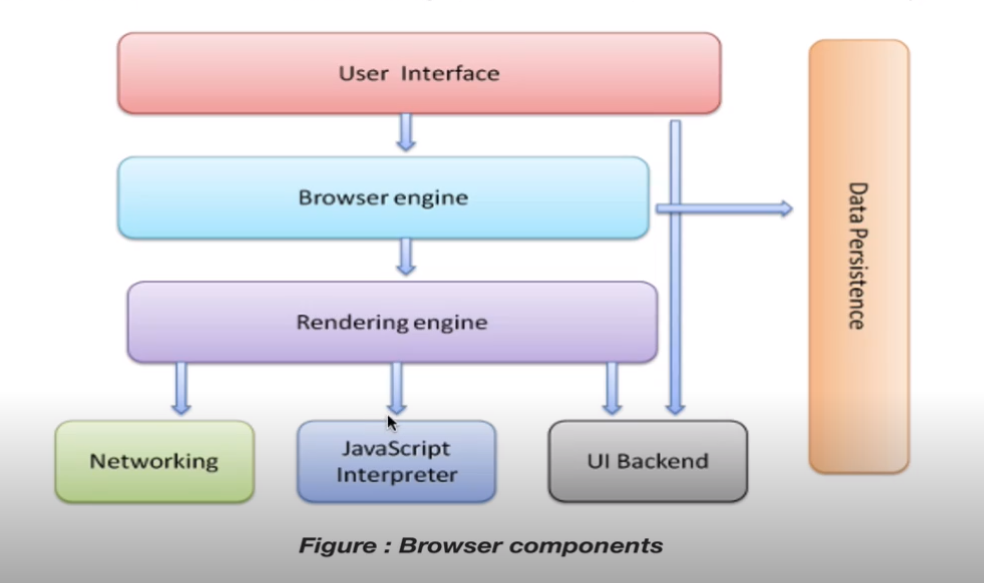
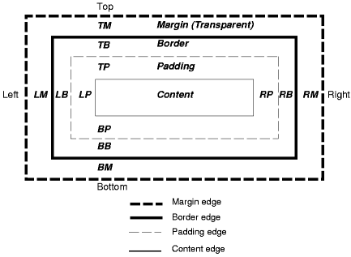

# 웹의 기초

- 본 폴더는 https://www.edwith.org 에서 제공하고 있는 웹 프로그래밍 강좌를 학습하기 위해 만들어졌습니다.

- 프론트 : html, css
- 백엔드 : 클라이언트, 서버, 요청-응답 과정 등

## 웹의 작동 방식

### 인터넷 통신의 이해

- 인터넷은 각각의 프로토콜과 포트 번호, 기능으로 구성된다.
- www이라고 불리는 인터넷의 경우 http 프로토콜을 이용하며, 80번 포트를 통해 웹 서비스를 제공한다.
- 인터넷이란 TCP/IP 기반의 네트워크가 전세계적으로 확장되어 하나로 연결된 네트워크들의 결합체라고 할 수 있다.

### http란?

- Hypertext Transfer Protocol의 약어이다.
- 서버와 클라이언트가 인터넷 상에서 데이터를 주고받기 위한 프로토콜이다.
- 전송 가능한 데이터에 제약이 없다. (이미지, 동영상, 오디오, 텍스트 등)
- http는 기본적으로 80번 포트로 가동된다.

### http의 작동 방식

- 서버/클라이언트 모델을 따른다.
- 클라이언트가 요청을 보내면, 서버가 응답한다.
- 무상태 프로토콜(stateless protocol) : 요청에 응답하고 나면 연결을 끊어버린다.
- 장점 : 불특정 다수를 대상으로 할 때 용이하다. 많은 요청/응답을 처리할 수 있다.
- 단점 : 클라이언트의 이전 상황을 알 수 없다.
- 개선점 : cookie -> 특정 정보를 유지하기 위한 기술이 등장.

### url이란?

- Uniform Resource Locator의 약어이다.
- 웹 서버에서 특정 파일에 접근하기 위한 경로 혹은 주소

> 접근 프로토콜 :// 주소 or 도메인 이름 / 문서의 경로 / 문서이름
>
> ex) http :// www.edwith.org / bostcourse-web/lecture/ 16661

### 데이터 요청/응답 과정

> 
>
> 웹은 다음과 같은 방식으로 동작한다.

- 요청 헤더 : 요청 메서드 + 요청 URI + http 프로토콜 버전 / 호스트 등
- 요청 바디 : GET은 요청 정보를 URI를 통해 전달하므로 바디가 없다. (POST/PUT에서만 사용)
- 응답 헤더 : http 프로토콜 버전 + 응답 코드 + 응답 메시지 / 날짜, 서버, 버전, 등
- 응답 바디 : 실제 응답 resource

### Q. http와 https의 차이?

- https는 http의 보안이 강화된 버전이다.
- 전자 상거래에서 널리 쓰이며, 데이터를 암호화하는 방식으로 주고 받는다.

## 웹 Front-End와 웹 Back-End

### 웹 프론트엔드

- 사용자에게 웹을 통해 다양한 컨텐츠(리소스)를 제공한다. 또한 사용자 요청에 반응하여 동작한다.
- 이때 컨텐츠를 잘 보여주기 위한 구조를 만들어줄 필요가 있다.
- 사용자와의 소통을 위한 디자인을 제공해야 한다.
- html, css, java script를 통해 구현한다.
  - html은 전체적인 페이지 계층 구조를 만들어준다.
  - css는 각 컨텐츠들의 배치를 담당한다.
  - java script는 웹을 동적으로 만들어준다.

> 
>
> 프론트엔드 3형제  (출처 : https://html-css-js.com/)

### 웹 백엔드

- 프론트 엔드가 클라이언트 입장에서 개발된다면 백 엔드는 서버 입장에서 개발이 진행된다.
- 클라이언트의 요청을 받아 서버로 넘겨주는 부분을 관할한다.
- java, python, php, javascript 등의 언어를 사용한다.
- 웹의 동작 원리, 알고리즘, 운영체제, 네트워크 등에 대한 이해가 필요하다.
- 프레임 워크에 대한 이해가 필요하다. (ex) Spring)
- DBMS에 대한 이해가 필요하다 (ex) MySQL, Oracle 등)

## 브라우저의 동작

### 브라우저 구성 요소

> 
>
> 
>
> 브라우저의 구성 요소들 (출처 : https://www.html5rocks.com)

### 렌더링 엔진

- 파이어 폭스의 게코, 사파리의 웹킷, 크롬과 오페라의 블링크가 해당된다.

- 작동 방식
  - HTML을 DOM 트리 구조로 파싱한다
  - 렌더 트리 구조를 만들어낸다
  - css 정보를 합쳐서 layout을 만들어낸다
  - 화면에 직접 렌더링 한다

### 파싱 방식

- 문서를 파싱한다는 것은 문서를 코드가 사용할 수 있는 구조로 변환시키는 것을 의미한다.

#### 추상 구문 트리(abstract syntax tree)

- 프로그래밍 언어로 작성된 소스 코드의 트리를 추상 구문 트리라고 한다.
- 각 노드는 소스 코드에서 발생되는 구조체를 나타낸다.
- 컴파일러는 소스 코드를 파싱하여 이러한 트리 구조를 만들어낸다.

#### html 파서

- html 문서(마크업)이 컴퓨터에 인식되어질 때도 마찬가지로 트리 구조로 처리된다.

- 이 때의 트리 구조를 DOM 트리라고 한다.

  ​						html

  ​				head			body

  ​				title			   div

  ​				"title"		h1		p1

  ​						     "Hello!"      "I'm Chanhee"

- 다음과 같이 아래로 이어지는 트리 구조로, 렌더 트리라고도 부른다.

#### css 파서

- 마찬가지로 트리 구조로 파싱한다.

- CSSStyleSheet 아래 CSSRule이 셀렉터와 선언부로 나뉘어 입력된다.

- css 괄호 내의 키:밸류가 곧 셀렉터와 선언부이다.

- css는 background color -> background image -> border -> children -> outline의 순서로 그려진다.

- 참고) css 박스 모델

  > 

## 브라우저에서의 웹 개발

- 크롬 브라우저에서 ctrl + shift + i를 누르면 개발자 도구가 실행된다.

- head 태그에는 문서에서 드러나진 않지만 필요로 하는 정보들이 수록된다.
- body 태그에는 화면에 표현되어야 할 태그들이 수록된다.
- 이처럼 html은 태그를 이용하여 페이지를 표현한다.
- css 코드는 주로 head 태그 안에 위치한다.
- js 코드는 페이지 렌더링을 방해할 수 있기 때문에 가급적 body 태그 뒤에 작성한다.
- 페이지를 로드했을 시에 head 태그 안에 필요한 작업이 먼저 수행된 후 body가 보여진다.

## 웹 서버

- 웹 서버는 소프트웨어를 말하기도, 그 소프트웨어를 기동하는 프로그램을 말하기도 한다.
- 웹 서버는 클라이언트가 요청하는 html 문서나 리소스를 전달하는 기능을 한다.
- 요청 리소스는 컴퓨터 내 정적 데이터일수도, js 코드에 의한 동적 결과일수도 있다.
- 웹 브라우저는 웹 서버에 접속하여 html 문서와 필요한 리소스들을 요청하고, 서버는 요청 받은 요소들을 브라우저에 전달한다. 
- Apache, Nginx, Microsoft, Google 등의 웹 서버들이 존재한다.
- Apache가 가장 널리 쓰이고 있으며, Nginx가 차세대 웹 서버로 주목받고 있는 추세이다.

## WAS

- WAS는 web application server의 약어이다.
- DBMS 프로그램을 사용하게 되면서 DB를 활용할 수 있게 되었으나, 이때 클라이언트의 부담이 커지게 되는 문제가 발생했다.
- 이를 해결하기 위해 미들웨어(middleware)이다. 미들웨어는 클라이언트와 DB서버 사이의 중계 서버 역할을 한다.
- 클라이언트는 요청을 전달하는 역할만 수행하면 되기 때문에 관리가 간편해졌다.
- WAS는 이러한 미들웨어의 일종이다.
- 웹 클라이언트가 더 이상 정적 컨텐츠만으로 구현되지 못하고 동적 컨텐츠를 요구하게 되면서, 이를 관리하는 미들웨어, WAS가 필요하게 되었다.

### WAS의 기능

1. 프로그램 실행 환경과 데이터 베이스 접속 기능을 제공한다.
2. 여러 개의 트랜지션을 관리한다.
3. 업무를 처리하는 비지니스 로직을 실행한다.

- 이 외에 웹 서버의 기능도 제공한다. (대표적인 WAS가 Tomcat이다.)
- 그러나 규모가 커질수록 웹 서버와 WAS를 분리하는 것이 유리하다.
- 장애 극복 기능(failover)이 그 목적이다.

