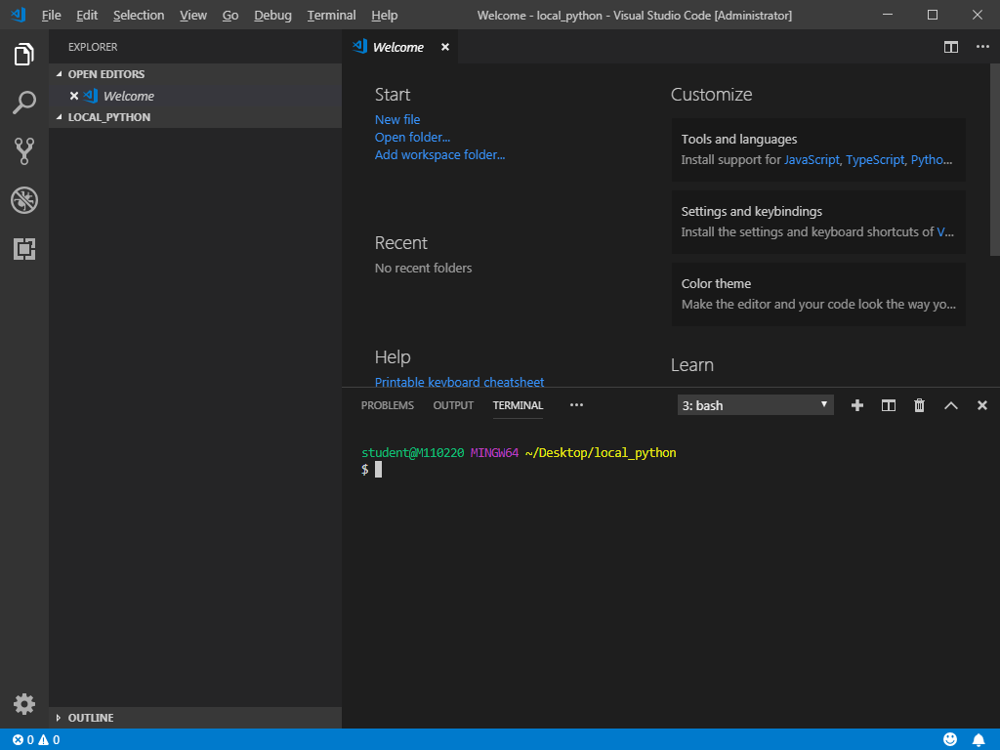

[TOC]

# CLI

> : Command Line Interface (<-> GUI)

- 글씨(명령어)만 입력해서 조작하는 방식
- 유닉스 shell, CP/M, DOS 등등이 이 방식을 사용


## 명령어 (리눅스)

- ls : 현재 디렉토리의 내용들을 나열
- cd : 현재 작업하는 디렉토리를 변경
- mkdir : 새로운 디렉토리 생성
- echo : 문자열 출력
- rm : 파일 지우기
- exit : 터미널 종료
- vi : 파일 에디터를 실행
  - i : insert 모드로 변경
  - esc : command 모드로 변경
    - :wq : 변경사항을 저장하고 종료
    - :q : 저장하지 않고 종료
- cat : 파일 내용 출력


## Chocolatey

- 윈도우에 걸맞은 프로그램 -> 나중에 한번 사용해 볼것
- choco install git -y ... git 설치 가능
- choco install python --version 3.6.7 ... python 설치 가능


## Git bash를 이용해 프로그램 실행하기

- vscode를 설치하면 code 명령어를 사용할 수 있다.

```bash
cd Desktop/
mkdir local_python
cd local_python/
code .
```

- vscode가 현재 폴더를 기준으로 실행된다.
- 실행된 vscode에서 ctrl + `
- terminal의 플러스 버튼을 누른 뒤에 customize => git bash 설정
- default shell 이 bash로 변경된다.



> 적용된 상태

```BASH
$ touch browser.py
```

- 파이썬 파일 생성
- Recommendation에 따라 Python과 Linter Extension을 설치해준다

- Korean Langauge Pack Extension을 설치하면 한국말 설정으로 바꿀 수 있다.


## Python에서 코드 작성하기

```python
import webbrowser

url = "https://search.naver.com/search.naver?query="
keyword = ["아이유", "itzy", "위너", "빅백"]
for k in keyword :
    webbrowser.open(url+k)
```

위 코드를 browser.py에 작성하고 bash에서

```bash
$ python browser.py
```

로 실행하면 각 keyword가 입력된 검색창 4개가 실행된다.

